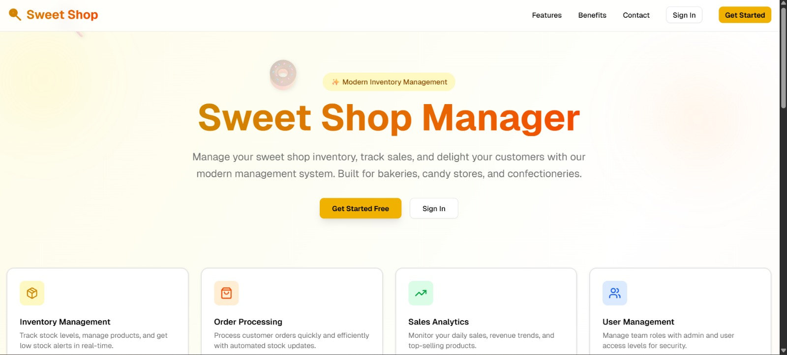
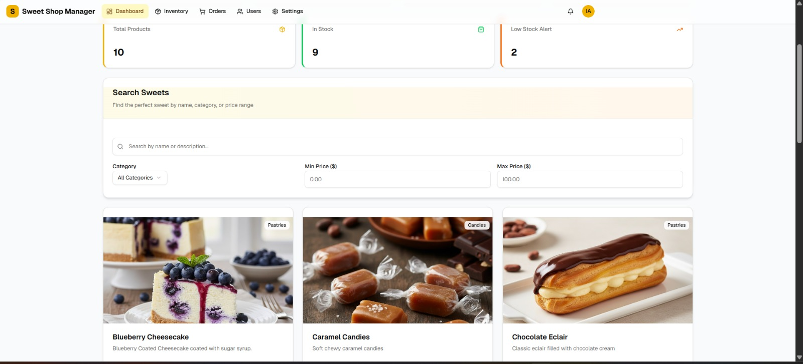
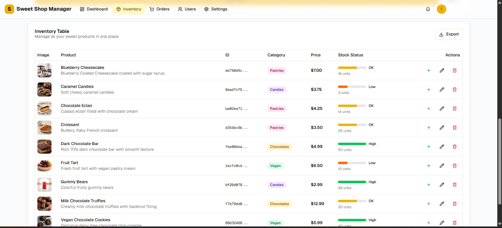

# 🍬 Sweet Shop Management System

A full-stack Sweet Shop Management System built as a Test-Driven Development (TDD) kata.  
The application allows users to browse and purchase sweets, while admins can manage inventory, orders, and stock levels through a secure backend.

🔗 **Live Application**:  
https://sweet-shop-manager-dlh4.vercel.app/

---

## 📌 Project Overview

This project demonstrates practical skills in:

- Backend API development with authentication
- Database-driven inventory management
- Frontend single-page application development
- Test-Driven Development (Red → Green → Refactor)
- Clean code and maintainable architecture
- Transparent and responsible use of AI tools

The system supports:
- User registration and login
- Viewing and searching sweets
- Purchasing sweets with stock validation
- Admin-only inventory and stock management
- Persistent UI preferences (dark mode)

---

## 🧱 Tech Stack

### Frontend
- Next.js (React)
- TypeScript
- Tailwind CSS
- Deployed on **Vercel**

### Backend
- Node.js with API routes
- Token-based authentication
- Role-based access control (User / Admin)

### Database
- Persistent database (Supabase / PostgreSQL)

### Testing
- Jest (unit and integration tests)
- Tests written before core backend logic (TDD)

---

## 🔐 Authentication & Authorization

- Users can register and log in securely
- JWT-based authentication protects API routes
- Admin-only permissions for:
  - Deleting sweets
  - Restocking inventory
  - Managing orders

---

## 🍩 Core Features

### User Features
- Register and log in
- View all available sweets
- Search sweets by name and category
- Purchase sweets (disabled if out of stock)
- Dark mode preference persists across refreshes

### Admin Features
- Add, update, and delete sweets
- Restock inventory
- Manage orders and user-order relationships
- Automatic stock decrement on purchase

---

## 🧪 Test-Driven Development (TDD)

The backend logic follows a **Red → Green → Refactor** approach:

1. **Red**: Tests written first for auth, orders, and inventory logic
2. **Green**: Minimal implementation to pass tests
3. **Refactor**: Cleanup for readability, separation of concerns, and maintainability

Commit history reflects this progression clearly, especially for:
- Authentication flow
- Order-user linkage
- Stock decrement logic

---

## 🧹 Clean Coding Practices

- Clear separation of concerns (auth, orders, inventory)
- Meaningful variable and function names
- Reusable utility functions
- No business logic inside UI components
- Comments added where intent is non-obvious

---
## ▶️ Running the Project Locally

### 1. Clone the repository

git clone https://github.com/Ishita-1956/sweet_shop_manager.git

     cd sweet_shop_manager

2. Install dependencies

      npm install

3. Set environment variables

Create a .env.local file with required keys (database, auth secrets).

4. Start the development server

      npm run dev

    📊 Test Report

Authentication logic: ✅ covered

Order creation and user linkage: ✅ covered

Stock decrement and validation: ✅ covered

Edge cases (out of stock, invalid user): ✅ covered

All tests pass before refactoring steps.

🤖 My AI Usage

AI tools were used intentionally and transparently to assist, not replace, development.

Tools Used
Claude
Reasoned about authentication edge cases

Helped debug broken auth flow

Assisted in designing order-user relationships

Suggested test cases for inventory logic

GitHub Copilot
Generated initial boilerplate for API handlers

Helped scaffold repetitive code

All generated code was manually reviewed and modified

Google Gemini
Used for UI experimentation and image generation

Assisted with visual layout ideas for product cards

Google Stitch
Explored UI layout patterns and animations

Ideas were applied manually, not auto-generated

How AI Helped My Workflow
AI reduced time spent on repetitive setup and helped me think through edge cases faster.
All architectural decisions, business logic, and final code structure were written and validated by me. AI was treated as a collaborative assistant, not an automated solution.

Each commit that involved AI usage includes a proper co-author attribution, as required.

📸 Screenshots

### Login

### Dashboard

### Homepage

### Admin Inventory

🚀 Deployment

Frontend deployed on Vercel

Live URL:
https://sweet-shop-manager-dlh4.vercel.app/

